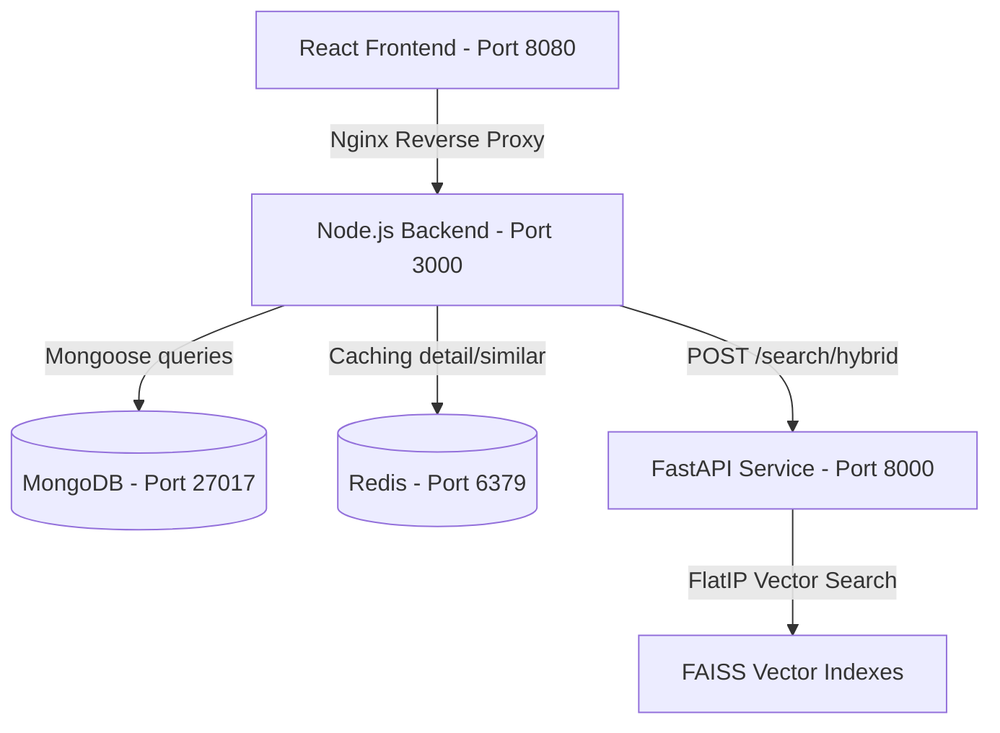

# Fashion AI Search Engine

A state-of-the-art visual and textual fashion search engine that leverages deep learning to match query text and images with apparel inventory. Powered by a compose-orchestrated microservices architecture combining a fine-tuned hybrid ViT recommender model, CLIP zero-shot color classification, a high-speed FAISS vector storage engine, and a Node/React backend.

---

## 🏗️ Architecture Overview

The system runs on Docker Compose, dividing tasks across five core services:



1. **Frontend (React)**: Served via Nginx on port `8080`, providing a sleek, modern visual interface for uploading query images or typing descriptive text.
2. **Backend (Node/Express)**: Manages product detail lookup, aggregates results, and serves static image file routing via port `3000`.
3. **AI Service (FastAPI)**: Serves model embeddings using a fine-tuned composition layer. Runs CPU-based FAISS vector indexing via port `8000`.
4. **Database (MongoDB)**: Persists metadata (names, categories, subcategories, colors, genders).
5. **Cache (Redis)**: Caches search results and product detail queries to ensure sub-millisecond response times.

---

## 🚀 Prerequisites

Ensure you have the following installed on your machine:
* **Docker Desktop** (with WSL2 integration enabled on Windows)
* **Python 3.10+** (if running ingestion or seeding scripts on the host)

---
## 📥 Model Downloads Setup

Because machine learning model weights are too large to be stored on GitHub, they are excluded from this Git repository. You **must** download them and place them in the correct directory before running the application:

1. **Download `model_555.pt` (CLIP fine-tuned color classifier)**:
   * **Source URL**: [Download via Google Drive](https://drive.google.com/file/d/1C-0v1QJ74TW6ztl6nJ3J4NzmKks7WW4_/view)
   * **Target Path**: `ai_service/models/model_555.pt`
2. **Download `SOTA_hybrid_model.pth` (SOTA Hybrid ViT Recommender)**:
   * **Source URL**: [Download via Google Drive](https://drive.google.com/file/d/17uNRWQc_8uWLxJ5-qg9mPUmpjk5C1lq6/view)
   * **Target Path**: `ai_service/models/SOTA_hybrid_model.pth`

*(Make sure you create the `ai_service/models/` folder if it doesn't already exist, and place both files directly inside it).*

---

## ⚡ Quick Start: Running with Docker

### Step 1: Clone and Enter the Directory
Navigate to the repository folder:
```bash
cd fashion-ai-search
```

### Step 2: Spin Up the Containers
Run Docker Compose in detached mode to download, build, and start all microservices:
```bash
docker compose up -d --build
```
This launches:
* MongoDB at `mongodb://localhost:27017`
* Redis at `redis://localhost:6379`
* AI FastAPI Service at `http://localhost:8000`
* Express Backend at `http://localhost:3000`
* Frontend App at **`http://localhost:8080`**

### Step 3: Populate the Database (High-Speed Seeding)
Since running model inferences on 39,203 images on a CPU host takes several hours, we provide a pre-indexed metadata restoration script. It instantly populates MongoDB with aligned categories, titles, ground-truth colors, and compliant gender fields:

1. Open your terminal in the `ai_service` directory:
   ```bash
   cd ai_service
   ```
2. Activate your virtual environment (if not already activated):
   * Windows: `.\venv\Scripts\activate`
   * Unix: `source venv/bin/activate`
3. Run the high-speed database repopulation script:
   ```bash
   python scripts/repopulate_db.py
   ```
This drops the `products` collection and repopulates the **39,203 products** in MongoDB in under 10 seconds.

---

## 🔄 Running Custom Data Ingestion from Scratch

If you add new images to `clothesimages/` or `women/` and want to re-run the deep learning feature extraction pipeline to generate fresh FAISS indexes:

1. Delete the checklist checkpoint and product IDs mapping:
   * Delete `ai_service/data/processed_images.txt`
   * Delete `ai_service/data/product_ids.txt`
2. Run the main Python ingestion script:
   ```bash
   python scripts/ingest_custom_data.py
   ```
*Note: Running feature extraction for 39,000+ images on a CPU will take several hours. If a CUDA-compatible GPU is available, the script will automatically use CUDA acceleration.*

---

## 🧪 API Verification & Testing

### Test Hybrid Search Endpoint
You can test the search API using curl:
```bash
curl -X POST http://localhost:3000/api/v1/search/hybrid \
     -H "Content-Type: application/json" \
     -d '{"query": "shirt"}'
```
Expected output: A `200 OK` JSON response returning the top 20 matched products from MongoDB including matching vector scores.

### Check Service Health
Navigate to:
* Backend health check: `http://localhost:8080/api/v1/health` or `http://localhost:3000/health`
* AI Service documentation: `http://localhost:8000/docs`

---

## 📂 Directory Structure

```text
fashion-ai-search/
├── docker-compose.yml       # Orchestrates the 5 core containers
├── .gitignore               # Root git exclusions for logs/binaries
│
├── ai_service/              # FastAPI Python service
│   ├── main.py              # Application entrypoint & routes
│   ├── ai_core.py           # Embeddings and model weights manager
│   ├── requirements.txt     # Python dependencies (PyTorch CPU, FAISS, etc.)
│   ├── data/                # Vector indexes, CSVs and checkpoints
│   └── scripts/
│       ├── ingest_custom_data.py  # Full DL model feature ingestion pipeline
│       └── repopulate_db.py       # Instant metadata seeding/restore script
│
├── backend/                 # Express.js Node server
│   ├── server.js            # Node app entry point
│   ├── models/              # Mongoose schemas (Product schema)
│   ├── controllers/         # Routing handlers for search/products
│   └── scrpits/             # Seeding fallback scripts
│
└── frontend/                # React Vite client app
    ├── src/                 # Client UI source components
    ├── nginx.conf           # Reverse-proxy & routing rules
    └── Dockerfile           # Multi-stage production build container
```

---

## 🔧 Troubleshooting

### 1. Images do not display in the UI
Verify that:
* The host paths are mounted correctly in `docker-compose.yml` under `backend.volumes`.
* Image URL queries return correctly. Sourcing `/images/women/tops/t-shirts/44306611/44306611_4.jpeg` should route through the frontend port `8080` (reversing to backend port `3000`) and serve the image file.

### 2. Search returns 0 results
Run `python scripts/repopulate_db.py` in the `ai_service` directory to ensure that product IDs in MongoDB align with the FAISS vector indices mapping.
